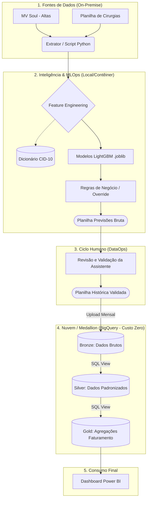

# Sistema Analítico Preditivo para Classificação Hospitalar (MLOps Edition)

**Status:** Em Produção | **Linguagem:** Python 3.12 | **Modelagem:** LightGBM + SMOTE | **Inteligência:** CID-10 Semantic Mapping

## Contexto do Problema e Impacto no Negócio
Hospitais lidam com um volume massivo de dados de internações que precisam ser classificados para faturamento e auditoria. As duas principais classificações são:
* **Grupo Assistencial (GRUPO_SUS):** Clínico, Cirúrgico, Diagnóstico, etc.
* **Complexidade Assistencial (COMPLEXIDADE_SUS):** Baixa, Média ou Alta complexidade.

**O Problema (Antes):** Processo manual de leitura de ~900 prontuários/mês, consumindo cerca de 40 dias de trabalho humano exclusivo.
**A Solução (Depois):** Pipeline de Machine Learning que reduz o tempo de processamento para menos de 1 minuto, mitigando glosas médicas e garantindo conformidade total com a LGPD.

## Métricas de Impacto e Evolução de Performance

| Métrica | Novembro/2025 | Janeiro/2026 | Março/2026 (v4.0) | Status |
| :--- | :--- | :--- | :--- | :--- |
| **Acurácia (Complexidade)** | 96% | 95% | **Aguardando Treino** | Estável |
| **Acurácia (Grupo SUS)** | 95% | 95% | **Aguardando Treino** | Estável |
| **Engenharia de Features** | Heurística (Regex) | Heurística (Regex) | **Mapeamento Semântico** | **Evolução Crítica** |

## Arquitetura e Jornada do Dado (End-to-End)

### 1. Extração e Integração (ETL)
* **Ingestão:** Carga de bases do Soul MV (Saídas e Cirurgias).
* **Auditoria:** Cruzamento automático para garantir que 100% das altas do MV foram processadas e identificar "pacientes intrusos" de outras unidades.

### 2. Governança e Blindagem (LGPD)
* **Anonimização:** Uso de SHA-256 com "Salt" secreto para CPFs e nomes antes da persistência em nuvem.
* **Segurança:** Credenciais gerenciadas via `.env` e Service Accounts do GCP.

### 3. Warehouse (Google BigQuery)
* Centralização do histórico hospitalar em tabelas estruturadas (Single Source of Truth) para treinamento e auditoria histórica.

### 4. Feature Engineering (v4.0)
Diferente das versões anteriores que extraíam apenas o primeiro caractere do CID, a v4.0 implementa:
* **Join com Dicionário Oficial:** Cruzamento dinâmico com a tabela de categorias CID-10.
* **Hierarquia Médica:** Injeção das colunas `CAPÍTULO BREVE` (ex: Doenças do Aparelho Circulatório) e `GRUPO` (ex: Doenças Hipertensivas).
* **Sanitização de Chaves:** Processamento rigoroso de strings (`strip`, `upper`) para garantir integridade no cruzamento de dados.
* **Atualização:** O pipeline de Feature Engineering agora realiza o cruzamento dos CIDs de entrada com a Tabela Oficial de Categorias do CID-10 (Capítulos e Grupos), permitindo que o modelo generalize melhor a complexidade baseando-se na família da doença, reduzindo o overfitting em CIDs raros.

### 5. Modelagem e MLOps
O pipeline utiliza `ImbPipeline` para garantir a reprodutibilidade:
* **Balanceamento:** SMOTE aplicado apenas nos dados de treino para lidar com classes minoritárias (ex: Alta Complexidade).
* **Encoding:** `OneHotEncoder` tratando as novas colunas semânticas de Capítulo e Grupo.
* **Algoritmo:** LightGBM serializado via `joblib`.

### 6. Business Rule Override (Regras de Negócio)
A IA é assistida por travas de segurança: se o modelo prever "Clínico" mas houver registro de código cirúrgico no sistema, o algoritmo realiza um *override* automático para "Cirúrgico", protegendo o faturamento.

## Tecnologias Utilizadas
* **Linguagem:** Python 3.12
* **Manipulação de Dados:** Pandas, Openpyxl
* **ML:** Scikit-Learn, LightGBM, Imbalanced-learn (SMOTE)
* **Cloud/DB:** Google BigQuery (GCP)
* **DevOps:** Git, VENV, Dotenv

## Próximos Passos (Roadmap de Evolução)

Para garantir a melhoria contínua da acurácia e a escalabilidade técnica, a evolução do sistema seguirá a ordem de priorização abaixo:

### 1. Fronteira da Ciência de Dados (Evolução da Inteligência)
- [ ] **IA Explicável (XAI - SHAP):** Integrar a biblioteca SHAP para "abrir a caixa preta" do modelo, justificando matematicamente o peso de cada variável na predição para suporte à auditoria médica.
- [ ] **Visão Longitudinal do Paciente:** Criar *features* que contabilizem o histórico de internações passadas, abandonando a visão de eventos isolados.
- [ ] **Predição Direta de Permanência Prolongada (PLoS):** Treinar modelo secundário de regressão para prever prospectivamente a quantidade de dias de internação, auxiliando no giro de leitos.
- [ ] **Processamento de Linguagem Natural (NLP):** Explorar modelos de linguagem para extrair contexto de textos clínicos livres (ex: notas de evolução).

### 2. Ciclo de Vida do Dado (DataOps & Human-in-the-Loop)
- [ ] **Retroalimentação do Banco de Dados:** Criar pipeline (`atualizar_historico_bq.py`) para fazer o *append* automatizado da planilha mensal revisada pela operação de volta no Google BigQuery.
- [ ] **Retreinamento Orientado a Valor:** Garantir que as execuções mensais de treinamento absorvam as correções humanas, fechando o ciclo de aprendizado contínuo da IA.

### 3. Produtização e Engenharia de Software
- [ ] **Interface de Usuário (GUI):** Desenvolver aplicação visual amigável (ex: Streamlit) para que usuários não-técnicos executem as predições mensais sem interação com código.
- [ ] **API RESTful (FastAPI):** Disponibilizar os artefatos `.joblib` via *web service* para integração em tempo real com o sistema MV Soul.
- [ ] **Containerização (Docker):** Empacotar o ambiente completo para eliminar falhas de dependência local (DLLs) e viabilizar agendamentos automáticos (Cron/Airflow).
- [ ] **Suíte de Testes (PyTest):** Implementar testes unitários para blindar as funções de limpeza e feature engineering contra quebras de schema.

### 4. Visão Executiva e Estratégica
- [ ] **Dashboard Executivo (Power BI):** Conectar os resultados diretamente ao BigQuery para visualização do impacto financeiro e suporte à tomada de decisão da diretoria.

---
*Desenvolvido por Ediney Magalhães | Analytics Engineer | Data Engineer | Estatístico*