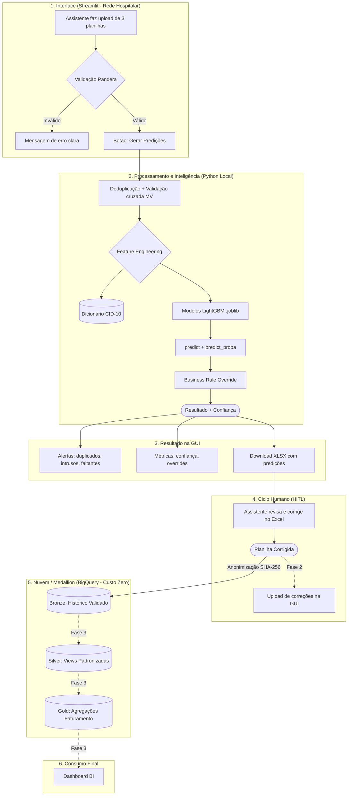

# Sistema Analítico Preditivo para Classificação Hospitalar SUS

**Status:** Em Produção | **Versão:** 5.0.0 | **Linguagem:** Python 3.12 | **Modelagem:** LightGBM + SMOTE | **Interface:** Streamlit (rede hospitalar)

---

## Contexto do Problema e Impacto no Negócio

Hospitais lidam com um volume massivo de dados de internações que precisam ser classificados para faturamento e auditoria SUS. As duas principais classificações são:
* **Grupo Assistencial (GRUPO_SUS):** Clínico, Cirúrgico, Diagnóstico, OPME.
* **Complexidade Assistencial (COMPLEXIDADE_SUS):** Atenção Básica, Média ou Alta Complexidade.

**O Problema (Antes):** Processo manual de leitura de ~900 prontuários/mês, consumindo cerca de 40 dias de trabalho humano exclusivo.

**A Solução (Depois):** Pipeline de Machine Learning com interface gráfica que reduz o tempo de processamento para menos de 1 minuto, operado por uma assistente não-técnica via navegador, com validação automática de dados, scores de confiança por predição e travas de segurança contra falsos positivos. Custo de infraestrutura: R$ 0,00/mês.

---

## Métricas de Impacto e Evolução de Performance

| Métrica | v1.0 (Set/2025) | v3.0 (Nov/2025) | v5.0 (Mai/2026) | Evolução |
| :--- | :--- | :--- | :--- | :--- |
| **Acurácia (Complexidade)** | ~85% | 96% | ~95-96% | Estável |
| **Acurácia (Grupo SUS)** | ~80% | 95% | ~95-96% | Estável |
| **Recall Alta Complexidade** | 56% | 89% | ~89% | +33pp |
| **F1-Score Grupo SUS** | 0.63 | 0.87 | ~0.87 | +0.24 |
| **Tempo de processamento** | ~40 dias | Minutos (terminal) | Minutos (GUI) | -99.9% |
| **Operador necessário** | Ediney (terminal) | Ediney (terminal) | Assistente (navegador) | Desacoplado |
| **Custo infraestrutura** | R$ 0 | R$ 0 | R$ 0 | Mantido |
| **Validação de entrada** | Nenhuma | Nenhuma | Pandera (3 schemas) | Novo |
| **Score de confiança** | Não | Não | Sim (predict_proba) | Novo |

---

## Arquitetura e Jornada do Dado (End-to-End)


```mermaid
graph TD
    subgraph "1. Interface (Streamlit - Rede Hospitalar)"
        A1[Assistente faz upload de 3 planilhas] --> A2{Validação Pandera}
        A2 -- Inválido --> A3[Mensagem de erro clara]
        A2 -- Válido --> A4[Botão: Gerar Predições]
    end

    subgraph "2. Processamento e Inteligência (Python Local)"
        A4 --> B1[Deduplicação + Validação cruzada MV]
        B1 --> B2{Feature Engineering}
        B2 -.-> B3[(Dicionário CID-10)]
        B2 --> B4[Modelos LightGBM .joblib]
        B4 --> B5[predict + predict_proba]
        B5 --> B6[Business Rule Override]
        B6 --> B7([Resultado + Confiança])
    end

    subgraph "3. Resultado na GUI"
        B7 --> C1[Alertas: duplicados, intrusos, faltantes]
        B7 --> C2[Métricas: confiança, overrides]
        B7 --> C3[Download XLSX com predições]
    end

    subgraph "4. Ciclo Humano (HITL)"
        C3 --> D1[Assistente revisa e corrige no Excel]
        D1 --> D2([Planilha Corrigida])
        D2 -. Fase 2 .-> D3[Upload de correções na GUI]
    end

    subgraph "5. Nuvem / Medallion (BigQuery - Custo Zero)"
        D2 -- Anonimização SHA-256 --> E1[(Bronze: Histórico Validado)]
        E1 -. Fase 3 .-> E2[(Silver: Views Padronizadas)]
        E2 -. Fase 3 .-> E3[(Gold: Agregações Faturamento)]
    end

    subgraph "6. Consumo Final"
        E3 -. Fase 3 .-> F1[Dashboard BI]
    end
```

---

## Principais Funcionalidades

### Interface Gráfica (Streamlit)
Assistente não-técnica opera via navegador na rede interna do hospital, sem contato com código ou terminal. O sistema valida os dados automaticamente antes de qualquer processamento.

### Validação de Dados em Camadas ([ADR-0001](docs/adr/0001-validacao-de-dados-em-tres-camadas.md))
| Camada | Ferramenta | O que valida |
| :--- | :--- | :--- |
| Configs e objetos Python | Pydantic v2 | Caminhos, features, variáveis de ambiente |
| DataFrames de entrada | Pandera | Schema das 3 planilhas (tipos, ranges, colunas) |
| Warehouse | dbt tests | Integridade e freshness (planejado, Fase 3) |

### Feature Engineering (Mapeamento Semântico CID-10)
Cruzamento dinâmico com dicionário oficial CID-10, injetando `CAPÍTULO BREVE` e `GRUPO` como features. Permite ao modelo generalizar padrões médicos por família de doença, reduzindo erro em CIDs raros.

### Scores de Confiança
Cada predição acompanha `CONFIANCA_GRUPO` e `CONFIANCA_COMPLEXIDADE` (max predict_proba). Valores abaixo de 70% são sinalizados na GUI, orientando a assistente a revisar com atenção.

### Business Rule Override
Trava de segurança: se o modelo prevê "Procedimentos clínicos" mas há registro de cirurgia realizada, o sistema corrige automaticamente para "Procedimentos cirúrgicos". Valores configuráveis via `config/settings.py`.

### Configuração Centralizada
Pydantic BaseSettings centraliza caminhos de modelos, listas de features, thresholds e variáveis de ambiente. Validação na inicialização — se algo estiver errado, o sistema não sobe.

### Privacidade (LGPD / Privacy by Design)
* Anonimização SHA-256 com salt criptográfico antes de qualquer envio à nuvem
* Dados de internação nunca transitam pela internet pública (GUI roda na LAN)
* Credenciais gerenciadas via `.env` e Service Accounts GCP (privilégio mínimo)

---

## Stack Tecnológica

| Categoria | Tecnologias |
| :--- | :--- |
| **Core** | Python 3.12, Pandas, Scikit-Learn |
| **Machine Learning** | LightGBM, Imbalanced-Learn (SMOTE) |
| **Configuração** | Pydantic v2 (BaseSettings), python-dotenv |
| **Validação** | Pandera (DataFrames), dbt tests (planejado) |
| **Interface** | Streamlit (GUI local na rede hospitalar) |
| **Data Warehouse** | Google BigQuery Free Tier |
| **Versionamento** | Git, GitHub |
| **Governança** | ADRs (MADR), Model Cards, Runbooks |

---

## Estrutura do Projeto

```
├── app.py                          # GUI Streamlit (entry point)
├── gerar_previsoes.py              # Orquestrador de predições (sem I/O)
├── executar_treino.py              # Pipeline de treinamento (BigQuery → modelo)
├── config/
│   └── settings.py                 # Configurações centralizadas (Pydantic)
├── src/
│   ├── preprocessing/
│   │   └── preparo_ml.py           # Limpeza e feature engineering
│   ├── inference/
│   │   └── predicao.py             # Predição, confiança, override, cache
│   ├── validacao/
│   │   └── validacao.py            # Schemas Pandera (3 planilhas)
│   └── ingestion/
│       ├── anonimizacao.py         # SHA-256 + salt
│       └── carga_bq.py            # Ingestão na Bronze
├── data/
│   └── Categorias de CIDs.xlsx     # Dicionário oficial CID-10
├── docs/
│   ├── adr/                        # Architecture Decision Records
│   ├── runbooks/                   # Procedimentos operacionais
│   └── model_cards/                # Documentação por versão de modelo
├── modelo_grupo_sus.joblib         # Modelo LightGBM — Grupo SUS
└── modelo_complexidade_sus.joblib  # Modelo LightGBM — Complexidade SUS
```

---

## Roadmap de Evolução

### Concluído
- [x] **Fase 0 — Governança:** ADRs, templates MADR, estrutura docs/
- [x] **Fase 1 — GUI Streamlit:** Interface completa com upload, validação Pandera, predição com confiança, download. Pendente: teste no PC do hospital

### Próximas Fases
- [ ] **Fase 2 — Ciclo HITL Automatizado:** Upload de correções pela assistente, detecção de diferenças, ingestão automática na Bronze
- [ ] **Fase 3 — Camada Analítica:** Silver/Gold em dbt, dashboard BI com métricas executivas
- [ ] **Fase 4 — Observabilidade:** Monitoramento de drift (PSI), performance ao longo do tempo, alertas
- [ ] **Fase 5 — Continuous Training:** Champion vs challenger, Model Registry, gates de qualidade
- [ ] **Fase 6 — Explicabilidade:** SHAP por predição, calibração de probabilidades
- [ ] **Fase 7 — Active Learning:** Priorização de revisão por incerteza, auto-aprovação de alta confiança
- [ ] **Fase 8 — Industrialização:** Docker, pytest, documentação completa, disaster recovery

---

## Como Executar

### Pré-requisitos
* Python 3.12+
* Arquivo `.env` com `SALT_SUS`, `GOOGLE_APPLICATION_CREDENTIALS`, `GCP_PROJECT_ID`
* Arquivo `.streamlit/secrets.toml` com senha de acesso

### Instalação
```bash
python -m venv venv
venv\Scripts\activate          # Windows
pip install -r requirements.txt
```

### Rodar a GUI
```bash
streamlit run app.py
```
Acesse via navegador: `http://localhost:8501` (ou `http://<IP-DO-PC>:8501` na rede local)

### Rodar via terminal (sem GUI)
Edite os nomes dos arquivos no bloco `if __name__ == '__main__'` de `gerar_previsoes.py`:
```bash
python gerar_previsoes.py
```

---

*Desenvolvido por Ediney Magalhães | Analytics Engineer | Data Engineer | Estatístico*